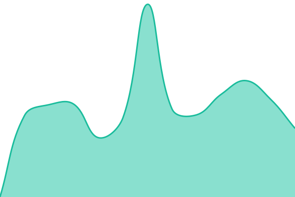
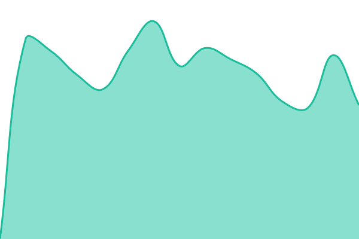

# [📈 Live Status](https://formfollowsyou.github.io/uptime): <!--live status--> **🟩 All systems operational**

This repository contains the open-source uptime monitor and status page for [Form Follows You](www.formfollowsyou.com), powered by [Upptime](https://github.com/upptime/upptime).

With [Upptime](https://upptime.js.org), you can get your own unlimited and free uptime monitor and status page, powered entirely by a GitHub repository. We use [Issues](https://github.com/formfollowsyou/uptime/issues) as incident reports, [Actions](https://github.com/formfollowsyou/uptime/actions) as uptime monitors, and [Pages](https://formfollowsyou.github.io/uptime) for the status page.

<!--start: status pages-->
<!-- This summary is generated by Upptime (https://github.com/upptime/upptime) -->
<!-- Do not edit this manually, your changes will be overwritten -->
<!-- prettier-ignore -->
| URL | Status | History | Response Time | Uptime |
| --- | ------ | ------- | ------------- | ------ |
|  [buildplace.io](https://buildplace.io/) | 🟩 Up | [buildplace-io.yml](https://github.com/formfollowsyou/uptime/commits/HEAD/history/buildplace-io.yml) | 

 1687ms
     
 | 

<a href="https://formfollowsyou.github.io/uptime/history/buildplace-io">90.07%</a>
    

|  [Kuma (Uptime Monitoring)](https://uptime.beta.formfollowsyou.com/) | 🟩 Up | [kuma-uptime-monitoring.yml](https://github.com/formfollowsyou/uptime/commits/HEAD/history/kuma-uptime-monitoring.yml) | 

 1253ms
     
 | 

<a href="https://formfollowsyou.github.io/uptime/history/kuma-uptime-monitoring">100.00%</a>
    

|  [beta.formfollowsyou.com](https://devweb.beta.formfollowsyou.com/) | 🟩 Up | [beta-formfollowsyou-com.yml](https://github.com/formfollowsyou/uptime/commits/HEAD/history/beta-formfollowsyou-com.yml) | 

 737ms
     
 | 

<a href="https://formfollowsyou.github.io/uptime/history/beta-formfollowsyou-com">99.23%</a>
    

|  [staging.formfollowsyou.com](https://web.staging.formfollowsyou.com/) | 🟩 Up | [staging-formfollowsyou-com.yml](https://github.com/formfollowsyou/uptime/commits/HEAD/history/staging-formfollowsyou-com.yml) | 

 768ms
     
 | 

<a href="https://formfollowsyou.github.io/uptime/history/staging-formfollowsyou-com">99.24%</a>
    

|  [Geodata (serve.buildplace.io)](https://geodata.serve.buildplace.io/health) | 🟩 Up | [geodata-serve-buildplace-io.yml](https://github.com/formfollowsyou/uptime/commits/HEAD/history/geodata-serve-buildplace-io.yml) | 

 636ms
     
 | 

<a href="https://formfollowsyou.github.io/uptime/history/geodata-serve-buildplace-io">100.00%</a>
    

<!--end: status pages-->

[**Visit our status website →**](https://formfollowsyou.github.io/uptime)

## 📄 License

- Powered by: [Upptime](https://github.com/upptime/upptime)
- Code: [MIT](./LICENSE) © [Anand Chowdhary](https://anandchowdhary.com)
- Data in the `./history` directory: [Open Database License](https://opendatacommons.org/licenses/odbl/1-0/)
